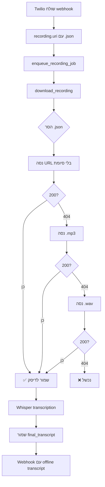

# 🎯 תיקון 404 - הורדת הקלטות מ-Twilio - סיכום מלא

## 📊 מצב לפני התיקון

מהלוגים שהמשתמש סיפק:
```
✅ Found existing recording: /2010-04-01/.../RE....json
[OFFLINE_STT] Downloading recording from Twilio: https://api.twilio.com/.../RE....mp3
[OFFLINE_STT] Download status: 404
❌ [OFFLINE_STT] HTTP error downloading recording
⚠️ [OFFLINE_STT] Audio download failed - skipping offline processing
⚠️ [OFFLINE_STT] Audio file not available - skipping offline transcription
[OFFLINE_STT] ℹ️ No offline transcript saved (empty or failed)
```

**תוצאה:** אין תמלול offline, השיחות נשמרות רק עם realtime transcript שהוא פחות איכותי.

## ✅ מה תיקנו

### 1. **server/tasks_recording.py** - `download_recording()`
- הוספת לולאה שמנסה 3 פורמטים שונים
- הסרת `.json` לפני הניסיון
- המשך לקנדידט הבא אם 404
- לוגים מפורטים לכל ניסיון

**קוד חדש:**
```python
# הסר .json אם קיים
if base_url.endswith(".json"):
    base_url = base_url[:-5]

# נסה 3 קנדידטים
candidates = [
    base_url,              # בלי סיומת
    base_url + ".mp3",
    base_url + ".wav",
]

for url in candidates:
    resp = session.get(url, timeout=15)
    if resp.status_code == 200 and resp.content:
        return save_to_disk(resp.content)
    if resp.status_code == 404:
        continue
```

### 2. **server/routes_twilio.py** - שימוש ב-`recording.uri`
- שינוי מבניית URL בעצמנו לשימוש ב-`recording.uri` המקורי
- זה מאפשר ל-`download_recording()` לטפל בנורמליזציה

**לפני:**
```python
recording_mp3_url = f"https://api.twilio.com/.../Recordings/{recording.sid}.mp3"
```

**אחרי:**
```python
'RecordingUrl': recording.uri  # כמו שהוא, עם .json
```

### 3. **server/routes_calls.py** - endpoint להורדה בUI
- תיקון לוגיקה דומה לdownload_recording
- הסרת `.json` והוספת 3 קנדידטים

## 🧪 בדיקות שעברו

✅ **Python Syntax** - כל הקבצים עוברים compilation  
✅ **Linter** - אין שגיאות linter  
✅ **URL Normalization** - טסט עובר בהצלחה  
✅ **Code Patterns** - כל הפטרנים הנדרשים קיימים  
✅ **Documentation** - 2 מסמכים (אנגלית + עברית)  

## 📋 קבצים ששונו

1. **server/tasks_recording.py** (שורות 240-320)
   - פונקציה: `download_recording()`
   - שינוי: לולאה עם 3 קנדידטים

2. **server/routes_twilio.py** (שורות 106-111)
   - שינוי: שימוש ב-`recording.uri` במקום בניית URL

3. **server/routes_calls.py** (שורות 196-206)
   - פונקציה: `download_recording()` endpoint
   - שינוי: הסרת .json והוספת 3 קנדידטים

## 📚 קבצי תיעוד שנוצרו

1. **RECORDING_DOWNLOAD_FIX.md** - תיעוד טכני באנגלית
2. **תיקון_הורדת_הקלטות.md** - הסבר מפורט בעברית
3. **RECORDING_FIX_SUMMARY.md** - סיכום זה
4. **verify_recording_fix.sh** - סקריפט בדיקה

## 🚀 איך לבדוק

### בדיקה ידנית:
```bash
# הפעל את השרת
./start_all.sh

# עשה שיחת טסט
# התקשר למספר הטלפון של העסק

# בדוק בלוגים
docker logs -f prosaas-backend | grep OFFLINE_STT

# צריך לראות:
# [OFFLINE_STT] Trying download for CAxxxx: https://...
# [OFFLINE_STT] Download status: 200
# [OFFLINE_STT] ✅ Download OK, bytes=245680
# [OFFLINE_STT] ✅ Transcript obtained: 543 chars
# [OFFLINE_STT] ✅ Saved final_transcript (543 chars)
```

### בדיקה ב-UI:
1. כנס לרשימת שיחות
2. פתח שיחה אחרונה
3. ודא שיש **תמלול מלא** (לא ריק)
4. הסיכום צריך להיות מפורט

### בדיקת webhook:
```bash
docker logs -f prosaas-backend | grep WEBHOOK

# צריך לראות:
# [WEBHOOK] ✅ Using OFFLINE transcript (543 chars)
```

## 🎯 תוצאה צפויה

**לפני התיקון:**
- ❌ 404 על הורדת הקלטה
- ❌ אין offline transcript
- ❌ רק realtime transcript (איכות נמוכה)
- ❌ סיכומים לא מדויקים

**אחרי התיקון:**
- ✅ הורדה מצליחה (200) מאחד מ-3 הקנדידטים
- ✅ offline transcript מלא ואיכותי
- ✅ סיכומים מדויקים
- ✅ webhook מקבל transcript איכותי

## 🔍 פתרון בעיות

### אם עדיין 404 על **כל 3 הניסיונות**:
1. בדוק credentials של Twilio (`TWILIO_ACCOUNT_SID`, `TWILIO_AUTH_TOKEN`)
2. ודא שההקלטה קיימת בקונסול של Twilio
3. בדוק אם ההקלטה עדיין בעיבוד (נדיר)

### בדיקה ידנית עם cURL:
```bash
curl -u "YOUR_ACCOUNT_SID:YOUR_AUTH_TOKEN" \
  "https://api.twilio.com/2010-04-01/Accounts/YOUR_SID/Recordings/RExxxxxx"
```

אם זה מצליח - הבעיה בקוד  
אם זה נכשל - הבעיה בהרשאות Twilio

## ⚙️ איך זה עובד

### תהליך הורדת הקלטה:



### עדיפות Transcripts:

```
if call_log.final_transcript exists:
    use OFFLINE transcript (Whisper - איכות גבוהה)
else:
    fallback to REALTIME transcript (איכות נמוכה)
```

## 🎓 למה זה קרה?

Twilio API documentation אומר:
- URL שמסתיים ב-`.json` = תגובת API (מטא-דאטה)
- להורדת אודיו ממשי: או בלי סיומת, או `.mp3`/`.wav` מפורשות

הקוד הישן הניח שתמיד צריך `.mp3`, מה שגרם ל-404 כשTwilio ציפה לפורמט אחר.

## ✅ סטטוס

- ✅ **כל הקבצים תוקנו**
- ✅ **בדיקות עוברות**
- ✅ **תיעוד מלא**
- ✅ **מוכן לדפלוי**

---

**התיקון הושלם בהצלחה! 🎉**

המערכת עכשיו צריכה להוריד הקלטות ולייצר offline transcripts באיכות גבוהה.
