# Recording Worker Fix - Verification Checklist

## ✅ Implementation Complete

### Changes Made:
1. ✅ `server/tasks_recording.py` - Queue-based worker system
2. ✅ `server/app_factory.py` - Worker thread startup
3. ✅ Syntax validated - no errors
4. ✅ Queue mechanism tested - working correctly

## 🔍 Expected Log Sequence (After Deploy)

### On App Startup:
```
✅ [OFFLINE_STT] Recording worker loop started
✅ [BACKGROUND] Recording worker started
```

### After Each Call Ends:
```
✅ Found existing recording for CA...: /2010-04-01/Accounts/.../Recordings/RE....json
✅ Recording queued for processing: CA...
✅ [OFFLINE_STT] Job enqueued for CA...
🎧 [OFFLINE_STT] Starting offline transcription for CA...
[OFFLINE_STT] Starting offline transcription for CA...
[OFFLINE_STT] ✅ Transcript obtained: XXXX chars
[OFFLINE_EXTRACT] Starting extraction for CA...
[OFFLINE_EXTRACT] ✅ Extracted: service='...', city='...', confidence=X.XX
✅ [OFFLINE_STT] Completed processing for CA...
```

## 🚀 Deployment Steps

1. **Deploy the changes** (both files modified):
   - `server/tasks_recording.py`
   - `server/app_factory.py`

2. **Restart the server** to start the worker thread

3. **Check startup logs** for:
   - `✅ [OFFLINE_STT] Recording worker loop started`
   - `✅ [BACKGROUND] Recording worker started`

4. **Make a test call** (5-10 seconds):
   - Wait for call to end
   - Wait 30-60 seconds
   - Check logs for [OFFLINE_STT] messages

5. **Verify in database**:
   - Check `call_logs` table for the call
   - Verify `final_transcript` is populated
   - Verify `extracted_service` / `extracted_city` (if applicable)

## 🐛 If Worker Doesn't Start

Check logs for:
```
⚠️ [BACKGROUND] Could not start recording worker: [error message]
```

Common issues:
- Import error → Missing dependency
- App context error → Database not initialized
- Thread error → System resource limit

## 🔄 How It Works

```mermaid
sequenceDiagram
    participant W as Webhook
    participant Q as Queue
    participant Worker as Worker Thread
    participant P as Processor
    
    Note over Worker: Started on app startup
    Worker->>Q: Blocking wait (queue.get())
    
    W->>Q: enqueue_recording_job()
    Note over Q: Job added to queue
    
    Q->>Worker: Job available
    Worker->>P: process_recording_async()
    Note over P: Download → Transcribe → Extract
    P-->>Worker: Complete
    Worker->>Q: task_done()
    Worker->>Q: Wait for next job
```



## 📊 Key Improvements

| Before | After |
|--------|-------|
| Spawn thread per recording | Single worker loop |
| No queue visibility | Queue-based processing |
| Missing [OFFLINE_STT] logs | Full logging at each step |
| Race conditions possible | Thread-safe queue |
| Hard to debug | Clear log markers |

## 🎯 Success Criteria

After deployment, you should be able to:

1. ✅ See worker startup logs
2. ✅ See [OFFLINE_STT] logs for each recording
3. ✅ See lead extraction logs
4. ✅ Find transcripts in database
5. ✅ Find extracted data in leads table

## 📝 Monitoring Commands

### Check if worker thread is running:
```python
import threading
print([t.name for t in threading.enumerate()])
# Should include 'RecordingWorker'
```

### Check queue size:
```python
from server.tasks_recording import RECORDING_QUEUE
print(f"Queue size: {RECORDING_QUEUE.qsize()}")
```

### Manual job enqueueing (for testing):
```python
from server.tasks_recording import enqueue_recording_job
enqueue_recording_job(
    call_sid="TEST123",
    recording_url="https://...",
    business_id=10,
    from_number="+972...",
    to_number="+972..."
)
```

## 🔧 Troubleshooting

### No [OFFLINE_STT] logs after call:
- Check: Is recording URL found? Look for "Found existing recording"
- Check: Is enqueue_recording_job called? Look for "Job enqueued"
- Check: Is worker stuck? Check queue size

### Worker crashes on first job:
- Check: Database connection working?
- Check: Whisper API credentials set?
- Check: Enough disk space for MP3 download?

### Jobs queued but not processed:
- Check: Worker thread still running?
- Check: App context valid?
- Check: Look for "[OFFLINE_STT] Worker error" logs

## 📚 Related Documentation

- Full implementation: `OFFLINE_RECORDING_WORKER_FIX.md`
- Original task: User query about missing [OFFLINE_STT] logs
- Related files: `server/services/lead_extraction_service.py`

---

**Status:** ✅ Ready for deployment
**Risk Level:** Low (backward compatible, existing webhooks unchanged)
**Rollback:** Easy (comment out worker startup in app_factory.py)
